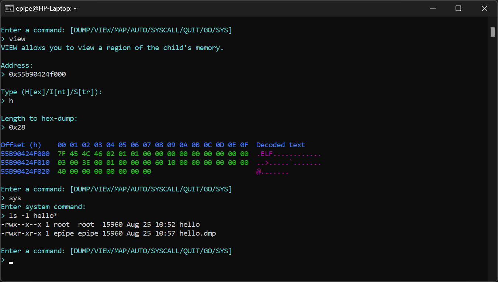

# ExeOnlyDump (xodump) - Linux Execute-Only Binary Dumper

Highly advanced execute-only binary dumper for x86-64 (AMD64, x64) Linux. Handles both statically- and dynamically-linked, normal and SUID Linux executables. Execute-only binaries are binaries that you can execute but not read, copy, debug and etc., typically used to prevent users from reproducing or reverse engineering internal corporate software.

&nbsp;&nbsp;&nbsp;

## History

I wrote this tool while doing a C programming university course. We had programming assignments, and the professors provided compiled assignment solutions as execute-only executables for us to test our implementations against. I asked one of the professors for permission to "steal" those demos and reverse engineer them, and I was given the go-ahead.

Nothing can read the memory of execute-only programs, but the program itself can. The demo executables were all dynamically-linked, so I exploited <code>LD_PRELOAD</code> to preload a library with a constructor function that dumps the mapped pages of the main executable.

I told the course staff about it, and they said they would start doing more static linking. At the same time, a debugging assignment was released and it involved an execute-only and SUID server component that students were not supposed to know about. <code>LD_PRELOAD</code> doesn't work on static or SUID binaries for obvious reasons, so I needed a better method.

I soon discovered that <code>strace</code> works on execute-only and/or SUID binaries. I threw together an <code>strace</code> knock-off to manipulate the <code>write</code> calls to <code>stdout</code> to dump the entire program (instead of just a string) onto the terminal, whenever <code>printf</code> is called. It worked and gave me access to the server backend of the debugging assignment, which allowed me to hunt down a backdoor/bug for getting free marks.

Afterwards, I extended my <code>strace</code> knock-off to inject arbitrary syscalls into the execute-only program, which basically allowed me to get the program to dump itself to a disk file for me. I also added some very basic debugging commands like memory dump, to add a layer of flexibility. I later shared the program privately with the course staff and promised them not to release it to anyone until they find a solution to secure their binaries.

The reason why I'm dropping this here is because they have finally secured those binaries. <b>Please do not use xodump to achieve any form of misconduct!</b> Please do not come to me crying if you get caught for using xodump to steal code you're not meant to access, you've been warned!

## How To Use ExeOnlyDump

### Fully Automatic Binary Dump
To automatically dump a binary without any form of user interaction, run the command:  
<code>xodump -o \<output-file\> \<input-executable\> </code>  
It will execute <code>\<input-executable\></code>, dump it and terminate it, all in one go. With this mode, you will not get the chance to actually let the executable run.

### Manual Binary Dump
If you want a bit of interaction, you can simply run:  
<code>xodump \<input-executable\> [args]</code>  
You will first land at a question asking if you really want to continue:

Then you will be prompted to choose a mode. You can choose automatic mode or interactive mode (or you can choose to quit the program):

#### Automatic
If you select automatic mode, you will be prompted for the name of the output file:

Then the executable will be dumped and you will be asked whether you want to continue its execution:

#### Interactive
If you select interactive mode, you will be asked which syscall to break at and whether you want to specify any additional conditions:

Just enter <code>12</code> for syscall and <code>no</code> for conditions, and you will be shown a memory map and a command prompt:

<code>DUMP</code> allows you to dump a range of memory to a disk file, <code>VIEW</code> allows you to view a region of memory, <code>MAP</code> shows the memory map, <code>AUTO</code> performs an automatic dump of the executable (same as automatic mode), <code>SYSCALL</code> performs a user-defined syscall injection, <code>QUIT</code> quits the program, <code>GO</code> continues the execution of the execute-only executable and <code>SYS</code> allows you to run a system command (eg: <code>ls</code> to list the directory). Here is a quick demonstration of some of the commands:

## Doing It From Scratch

### Arbitrary Syscall Injection

Assuming that the debuggee is stopped at a syscall entry, save all registers. Load a custom set of registers for the syscall you want to inject and execute the syscall. After syscall execution is done, save the result and restore the registers from the register save you have made earlier. Step back an instruction and return the syscall result you saved.

### Debuggee Memory Allocation

It is not possible to use the debuggee's heap to allocate memory, so you directly map memory by injecting <code>mmap</code> calls. After you're done with the memory, throw it away with <code>munmap</code>.

### Debugger/Debuggee Communication

Communication can be done through pipes. Create a pipe before you fork and use that pipe to talk to the debuggee. To transfer a buffer from the debugger to the debuggee, allocate it first by injecting <code>mmap</code>. After the debuggee has free memory to receive the buffer, write the buffer to the write end of the pipe from the debugger. Finally, make the debuggee read the buffer to the allocated memory from the read end of the pipe by injecting <code>read</code> calls. Debuggee to debugger memory transfers can be done in the same fashion. It is very important to note that the debugger and debuggee cannot be running at the same time (they wait on each other), so you don't want to write too much stuff to the pipe so that it blocks the current program and give you a deadlock.

Shared memory should also work, but I have not tested it yet. It will be a pain when it comes to memory transfer from the debuggee to the debugger, as you will have to actually inject code to copy the memory to the shared pages.

### Binary Dumping

Inject <code>open</code> and <code>read</code> to read the debuggee's <code>/proc/self/maps</code> file, transfer it to the debugger. Parse it and inject <code>write</code> calls to write the desired regions of memory to a disk file.

## Limitations
* <code>ptrace</code> must be available. This should be the case for most systems. If not, you can use the <code>LD_PRELOAD</code> trick if the executable is not static or SUID.
* Symbols cannot be dumped. I don't believe they are normally mapped into memory.
* My code only works on x86-64 Linux. However, it shouldn't be too hard to port it to other architectures and Unix-like operating systems.
